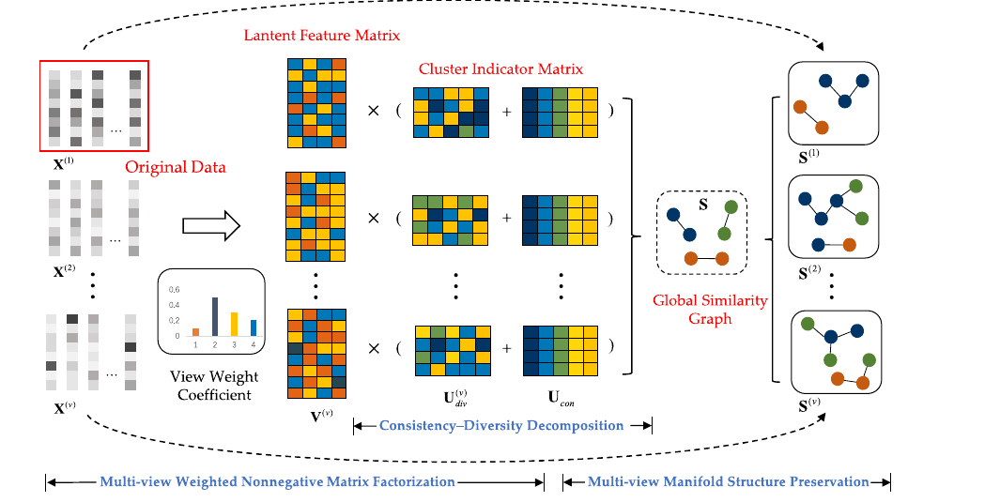
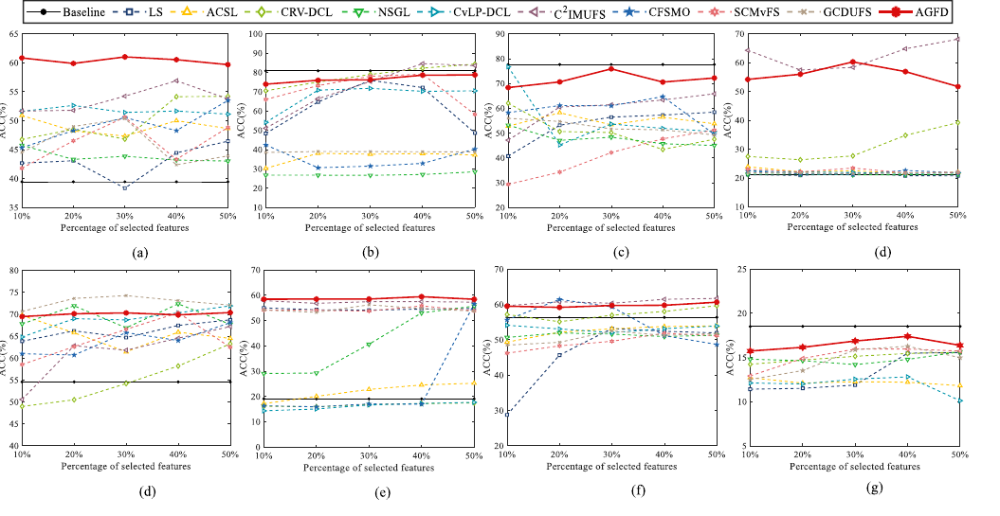
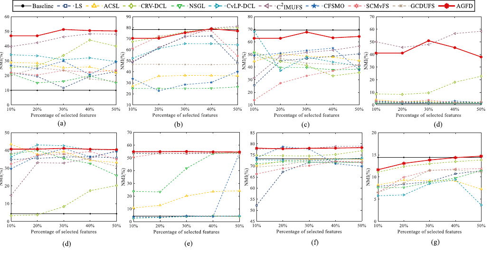
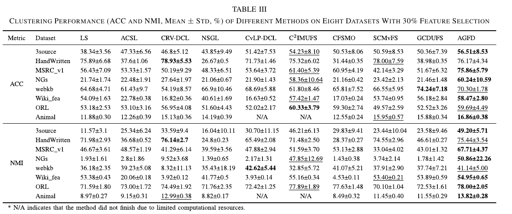
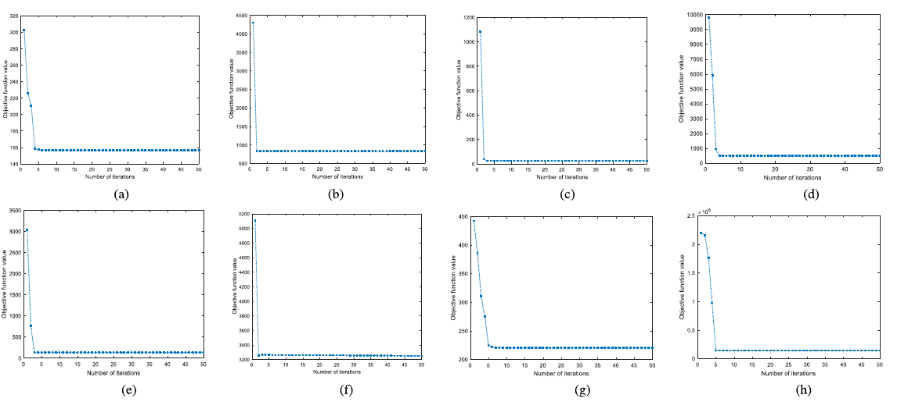

# AGFD: Adaptive Graph-Guided Feature Decomposition

MATLAB implementation of **Adaptive Graph-Guided Feature Decomposition (AGFD)** for unsupervised multi-view feature selection.

AGFD integrates feature selection into a non-negative matrix factorization framework. It decomposes the clustering indicator into shared consistency and view-specific diversity components, learns adaptive view weights, and refines a global similarity graph using Kullback-Leibler (KL) divergence to preserve the nonlinear manifold structure of multi-view data.

This code corresponds to the TNNLS paper:

> Aihong Yuan, Hong Lv, Jin Hu, and Mengbo You, "Adaptive Graph-Guided Feature Decomposition for Unsupervised Multiview Feature Selection," IEEE Transactions on Neural Networks and Learning Systems, 2026.

Project code page: <https://github.com/ahyuan/Multi-view/tree/main/AGFD>

## Highlights

- Unsupervised multi-view feature selection without requiring class labels during optimization.
- Joint optimization of pseudo-label learning and feature selection in an NMF-based model.
- Consistency-diversity decomposition for capturing common and complementary information across views.
- Adaptive global graph construction based on KL divergence.
- Adaptive view weighting to reduce manual hyperparameter dependence.
- Feature ranking output for selecting the top discriminative features.

## Method Overview



AGFD alternates between graph refinement and NMF-based feature selection. The consensus component captures common structure across views, while the diversity component captures view-specific information.

| Module | What it learns | Role in AGFD |
| --- | --- | --- |
| Adaptive view weighting | View weights `alpha_v` | Assigns larger weights to more informative views. |
| Weighted NMF | `U_con`, `U_div`, and `V` | Jointly learns pseudo-label structure and feature scores. |
| KL-guided graph learning | Global similarity graph `S` | Refines view graphs and preserves nonlinear manifold structure. |
| Sparse feature scoring | Row norms of `V` | Ranks features in the concatenated multi-view feature space. |

## Files

```text
AGFD/
|-- AGFD.m              # Main AGFD optimization and feature ranking function
|-- updateUdiv.m        # FISTA-based update for the view-specific diversity component
|-- NormalizeFea.m      # Feature or graph normalization utility
`-- datasets/           # Example multi-view datasets used by the code
```

Main function:

```matlab
[objectives, score, index] = AGFD(X, beta, r, tau, NITER, NMF_k, vN)
```

Inputs:

| Name | Description |
| --- | --- |
| `X` | Cell array of view matrices. Each `X{v}` is `n_samples x n_features_v`. |
| `beta` | Graph regularization parameter. |
| `r` | Exponent parameter for adaptive view-weight learning. |
| `tau` | Regularization parameter used in the consensus component update. |
| `NITER` | Maximum number of optimization iterations. |
| `NMF_k` | Latent factorization dimension. |
| `vN` | Number of views. |

Outputs:

| Name | Description |
| --- | --- |
| `objectives` | Objective value at each iteration. |
| `score` | Feature importance scores after concatenating all views. |
| `index` | Feature indices sorted by descending importance. |

## Algorithm Steps

| Step | Operation | Code location |
| ---: | --- | --- |
| 1 | Initialize view weights, consensus component, diversity components, feature matrices, and graphs. | `AGFD.m` |
| 2 | Update adaptive view weights `Alpha`. | `AGFD.m` |
| 3 | Update feature coefficient matrices `V`. | `AGFD.m` |
| 4 | Update diversity components `U_div` using FISTA. | `updateUdiv.m` |
| 5 | Update shared consensus component `U_con`. | `AGFD.m` |
| 6 | Update the global similarity graph `S`. | `update_S_gpu.m` or the CPU block in `AGFD.m` |
| 7 | Compute feature scores and sort features. | `AGFD.m` |

## Dependencies

- MATLAB R2020a or later is recommended.
- Statistics and Machine Learning Toolbox is useful for downstream clustering evaluation.
- Parallel Computing Toolbox is optional, but the code checks for GPU availability through `gpuDeviceCount`.
- The graph construction helper `constructW.m` must be on the MATLAB path. In the `Multi-view` repository layout, a compatible copy appears in the sibling `WGRFS/` directory.
- `AGFD.m` calls `update_S_gpu.m` for the optimized global similarity update. If this file is not present in your local copy, add the helper implementation to the MATLAB path or replace the call with the commented CPU update block inside `AGFD.m`.

## Datasets Included in This Code Directory

Each `.mat` file contains:

- `X`: cell array of multi-view feature matrices.
- `Y`: ground-truth labels, used only for evaluation after feature selection.

Example datasets are provided under `datasets/`. The paper reports experiments on eight public multi-view datasets: 3sources, HandWritten, MSRC v1, NGs, webkb, Wiki fea, ORL, and Animal.

## Quick Start

Run the following example from the `AGFD/` directory. Make sure `constructW.m` and `update_S_gpu.m` are also on the MATLAB path.

```matlab
clear; clc;

addpath(genpath(pwd));

% If you are using the full Multi-view repository layout, this adds constructW.m.
if isfolder(fullfile('..', 'WGRFS'))
    addpath(genpath(fullfile('..', 'WGRFS')));
end

load(fullfile('datasets', '3sources.mat'));  % loads X and Y
X = X(:)';                                   % use a row cell array
vN = numel(X);

beta = 1e2;
r = 2;
tau = 1e-3;
NITER = 20;
NMF_k = round(0.3 * size(X{1}, 1));

[objectives, score, index] = AGFD(X, beta, r, tau, NITER, NMF_k, vN);

feature_ratio = 0.3;
total_features = sum(cellfun(@(z) size(z, 2), X));
topK = round(feature_ratio * total_features);
selected_features = index(1:topK);
```

Common parameter choices:

| Parameter | Typical setting | Notes |
| --- | --- | --- |
| `beta` | Grid search in `{1e-3, 1e-2, ..., 1e3}` | Controls graph regularization strength. |
| `r` | `2` | Exponent used in adaptive view-weight learning. |
| `tau` | Small positive value such as `1e-3` | Used in the consensus component update. |
| `NITER` | `20` | The paper reports fast convergence, often within about five iterations. |
| `NMF_k` | Percentage of sample size or feature scale | The paper varies this according to dataset size. |
| `feature_ratio` | `0.1` to `0.5` | Evaluation commonly selects 10% to 50% of features. |

The returned `selected_features` are indices in the concatenated feature space `[X{1}, X{2}, ..., X{vN}]`. To map a global feature index back to its view:

```matlab
dims = cellfun(@(z) size(z, 2), X);
edges = [0, cumsum(dims)];

view_id = arrayfun(@(j) find(j <= edges(2:end), 1), selected_features);
local_id = selected_features(:) - edges(view_id(:));
```

## Evaluation Protocol Used in the Paper

The paper evaluates selected features by running k-means on the reduced feature representation and reporting:

- ACC: clustering accuracy.
- NMI: normalized mutual information.

Feature selection ratios are varied from 10% to 50% with a step size of 10%. After feature selection, k-means clustering is repeated 20 times and average results are reported.

## Visual Results

The following screenshots are cropped from the paper PDF to show the main experimental evidence.









## Result Highlights

| Analysis | Reported observation |
| --- | --- |
| Overall clustering performance | AGFD achieves top performance on most benchmark datasets at a 30% feature selection ratio. |
| MSRC v1 | AGFD exceeds the second-best method by 14% in ACC and 19.5% in NMI. |
| NGs | AGFD improves over GCDUFS by 38.8% in ACC and 49.1% in NMI. |
| Feature ratio robustness | AGFD remains stable across feature selection ratios from 10% to 50%. |
| Convergence | The objective function converges within about five iterations on the eight benchmark datasets. |
| Adaptive weights | View weights stabilize within about five iterations and assign larger weights to more informative views. |

## Ablation Summary

| Variant | Added component | Main takeaway |
| --- | --- | --- |
| Baseline `b` | NMF-based multi-view feature selection with manifold constraints | Provides the base feature selection model. |
| `b + alpha` | Adaptive view weighting | Improves balance among heterogeneous views. |
| `b + alpha + d` | Consistency-diversity decomposition | Separates shared and view-specific information. |
| AGFD | KL-guided global graph learning plus all above modules | Achieves the best ACC and NMI across the ablation settings reported in the paper. |

## Citation

If you use this code, please cite:

```bibtex
@article{yuan2026adaptive,
  author  = {Aihong Yuan and Hong Lv and Jin Hu and Mengbo You},
  title   = {Adaptive Graph-Guided Feature Decomposition for Unsupervised Multiview Feature Selection},
  journal = {IEEE Transactions on Neural Networks and Learning Systems},
  year    = {2026},
  pages   = {1--15},
  doi     = {10.1109/TNNLS.2026.3694172},
  note    = {Early access}
}
```

## License

The parent repository is released under the MIT License.
